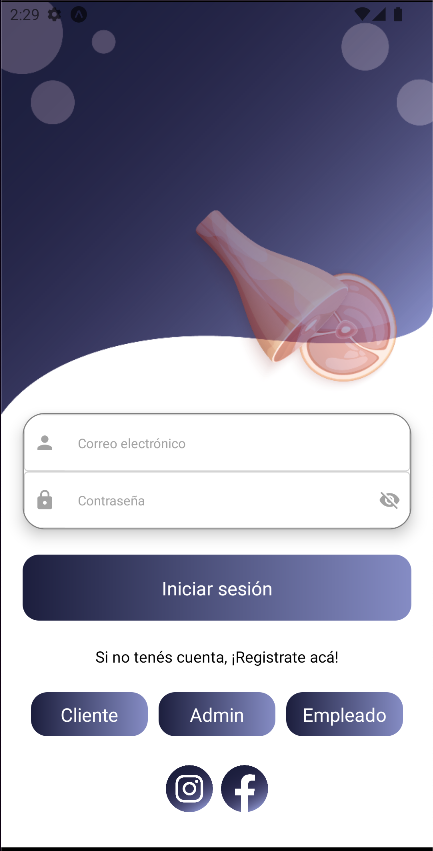
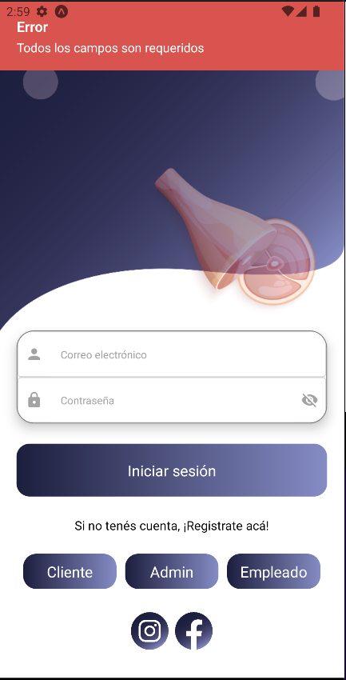
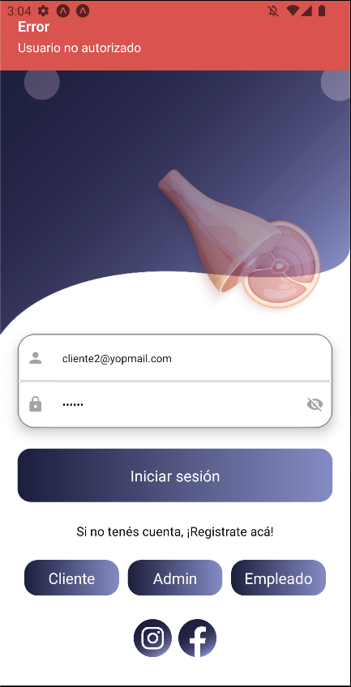
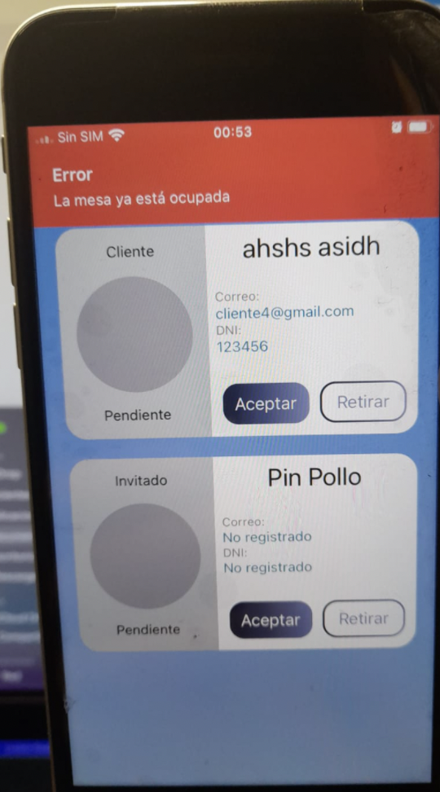
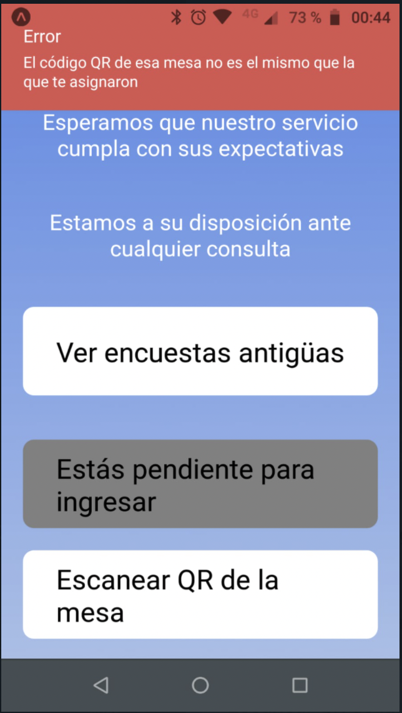
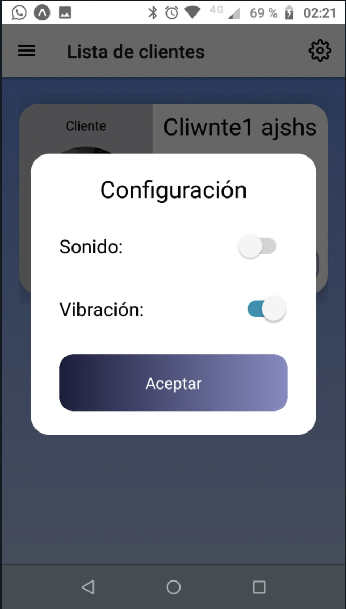

# 2022_TP_PPS_Comanda_1_cuatri
Trabajo práctico grupal - PPS - segundo parcial

Nomenclatura de ramas de GitHub

Tipo de requisito o acción / Modulo a desarrollar
Si el módulo cuena con más de una palabra, se separará con un guión bajo. ("_")

Ejemplo: feature/login | feature/create_user

## Reactanos Bar  - TAREAS :

Otras asignaciones:
Diseño de icono-splash: Ezequiel
Pantalla de login: Alan
Firebase : Ezequiel
Correo: Ezequiel
Repositorio: Luciano

#### Altas 
A- Alta de dueño/supervisor: Luciano (Finalizado)

B- Alta de empleados: Luciano (Finalizado)

C- Alta de clientes: Ezequiel (Finalizado)

D- Alta de Mesa: Alan (Finalizado)

E- Alta de productos: Alan (Finalizado)

#### QR

E- Qr de ingreso al local: Ezequiel / Luciano

F- Qr de la mesa: Alan (En Progreso)

#### Encuestas

H- Clientes: Alan

i - Empleados: Ezequiel

J- Supervisor: Luciano

#### Gestión

K- Agregar un nuevo cliente registrado: Alan

L- Ingresar al local: Ezequiel

M- Realizar pedidos: Luciano

O- Generar reservas agendadas: Alan / Ezequiel / Luciano

### Pantalla de inicio.
  
 
### Cliente/Invitado qr ingreso al local
 

### Asignacion de mesa desde metre

### Cliente/Invitado qr para acceder a la mesa asignada
 

### Vista desde metre, error al asignar mesa

### Lecture QR Incorrecto Cliente/Invitado.
 

### Panel de administrador

### Modal de configuracion para sonido y vibracion.
 